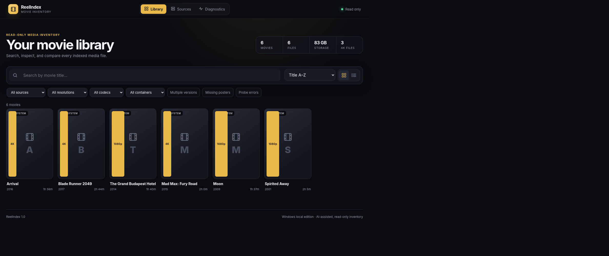

# ReelIndex

ReelIndex is a local, read-only movie inventory application for **Windows,
Docker, and Unraid**. It indexes movie libraries from local folders, mapped
or mounted paths, UNC/SMB shares, Plex, Jellyfin, or Emby and presents
searchable poster and table views with technical media details.

The Windows and Docker/Unraid editions use the same v1.4.8 FastAPI backend and
browser interface.



## Download for Windows

Download the current installer from
[`dist/ReelIndex-Windows-Setup-v1.4.8.exe`](dist/ReelIndex-Windows-Setup-v1.4.8.exe).

The installer is not digitally signed, so Windows SmartScreen may show an
unknown-publisher warning. Verify it against [`dist/SHA256SUMS.txt`](dist/SHA256SUMS.txt)
before running it.

Requirements:

- Windows 10 or Windows 11, 64-bit
- Internet access during standard installation
- A movie folder, mapped drive, UNC share, Plex server, Jellyfin server, or Emby server
- A read-only server token when using a media-server source

The installer does not require administrator rights. ReelIndex installs for
the current Windows user.

## Docker and Unraid

The published image is:

```text
ghcr.io/bclark303/reelindex:1.4.8
```

Start it with the included Compose file:

```bash
cp .env.example .env
mkdir -p data media
docker compose up -d
```

Open `http://localhost:8080` and configure a filesystem source using `/media`.
The Compose and Unraid configurations mount movie libraries read-only.

Unraid users can use [`packaging/unraid/my-ReelIndex.xml`](packaging/unraid/my-ReelIndex.xml).
See [`docs/DOCKER-UNRAID.md`](docs/DOCKER-UNRAID.md) for installation, additional
library mappings, PUID/PGID handling, and v1.0.3 upgrade guidance.

## Highlights

- Read-only media inventory; no rename, move, delete, or media-server mutation actions
- Poster grid and dense list views
- Search and filters for source, resolution, codec, container, edition, poster status, and probe status
- Native bounded parsers for MKV/WebM, MP4/M4V/MOV, AVI, ASF/WMV, MPEG-TS/M2TS/MTS, and MPEG-PS/MPG
- `ffprobe` compatibility fallback for unusual or malformed files
- Resumable Deep Scan queue with bounded concurrency
- Local sidecar, media-server, embedded, and optional TMDB posters
- Direct IMDb-ID poster matching and manual poster search/upload
- Probe Failures workspace with diagnosis and targeted native, extended, or ffprobe retries
- Encrypted stored source credentials
- Scheduled scans, live progress, structured logs, and diagnostics

## Competition baseline and historical releases

The original competition submission is preserved as the
**[v1.0.0 Competition Baseline](https://github.com/bclark303/ReelIndex/releases/tag/v1.0.0)**,
including its Windows installer and exact source snapshot. Every subsequent
Windows revision and the original Unraid line remain available under Releases.
See [`docs/RELEASE-HISTORY.md`](docs/RELEASE-HISTORY.md).

## First run

1. Install or start ReelIndex.
2. Open **Sources** and select **Add source**.
3. Choose **Filesystem**, **Plex**, **Jellyfin**, or **Emby**.
4. Test and save the connection.
5. Run a **Quick scan** for normal inventory maintenance.
6. Use **Deep scan** when technical metadata needs to be refreshed or completed.

Filesystem examples:

```text
D:\Movies
M:\Media\Movies
\\NAS\Media\Movies
/media
/media2
```

Optional TMDB poster matching requires your own TMDB API read token. Tokens and
application data are not included in this repository.

## Persistent data

Windows application data:

```text
%LOCALAPPDATA%\ReelIndex
```

Docker/Unraid application data:

```text
/data
```

These locations contain the SQLite database, encrypted credentials, scan logs,
resumable queues, and cached posters. Do not publish them.

## Source layout

```text
backend/             Canonical FastAPI backend and automated tests
web/                 Canonical browser interface used by every edition
windows/app/         Generated self-contained Windows payload copy
windows/launcher/    Windows launcher source
windows/installer/   Windows installer source
packaging/docker/    nginx and container entrypoint
packaging/unraid/    Unraid template, icon, and instructions
docs/                Build, deployment, history, and validation notes
dist/                Published release assets
scripts/             Package synchronization and validation helpers
```

Run `python scripts/sync-packages.py` after changing `backend/app` or `web`.
CI runs `python scripts/sync-packages.py --check` to prevent Windows and Docker
from drifting again.

## Development

```bash
cd backend
python -m venv .venv
# Windows: .venv\Scripts\activate
# Linux/macOS: source .venv/bin/activate
python -m pip install -r requirements-dev.txt
pytest -q
```

The v1.4.5 validation run passed all 82 backend tests and an upgrade test using
v1.0.3 appdata. See [`docs/VALIDATION-v1.4.5.md`](docs/VALIDATION-v1.4.5.md).

## Privacy and safety

- Movie files and sidecars are opened read-only.
- ReelIndex writes only to its application-data directory.
- Source tokens are encrypted before storage.
- API responses and diagnostics mask stored credentials.
- Do not upload database files, `.secret_key`, logs, cached posters, or `.env` files.

## License

No open-source license has been selected yet. Unless a license is added,
copyright and reuse rights remain with the project owner.
